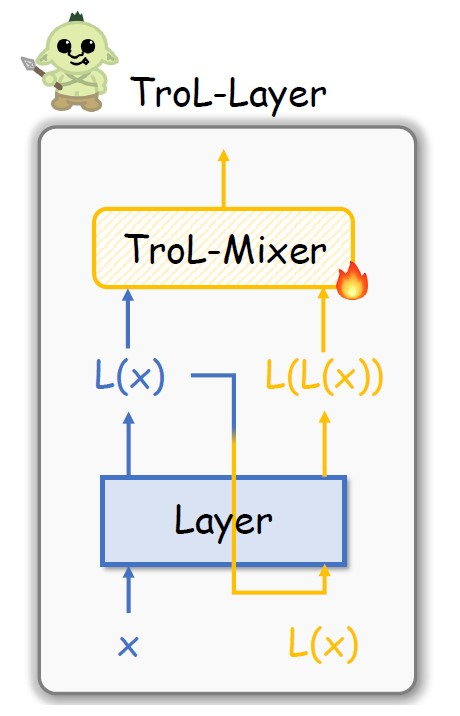
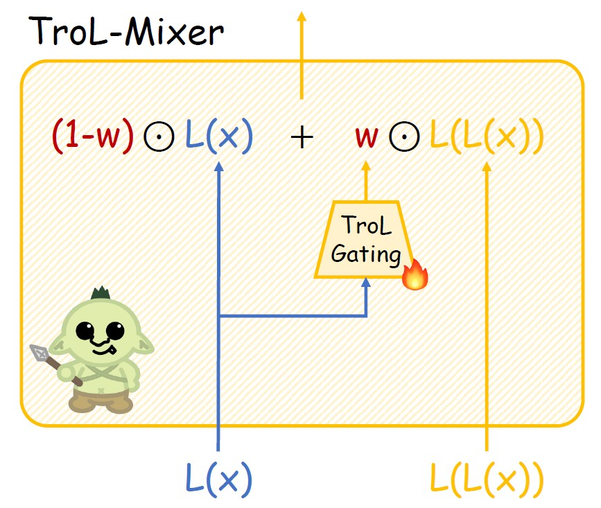
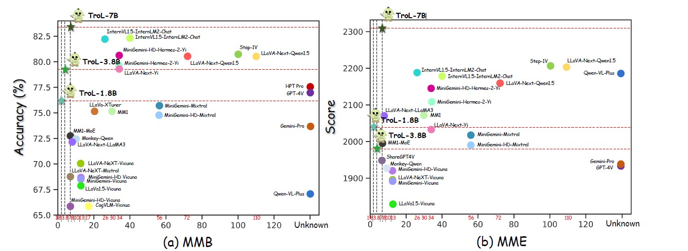
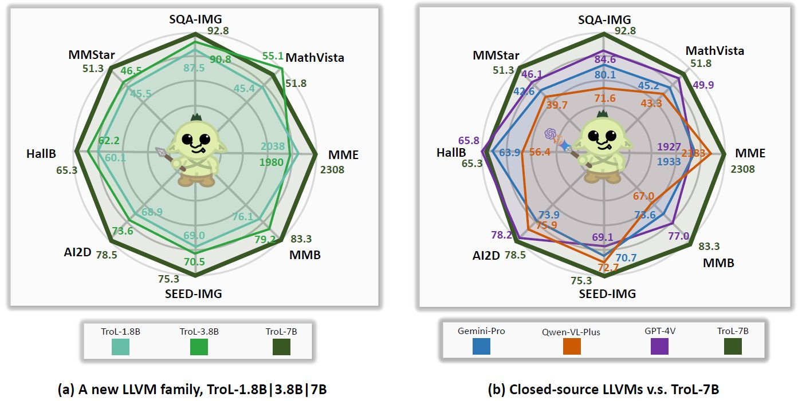
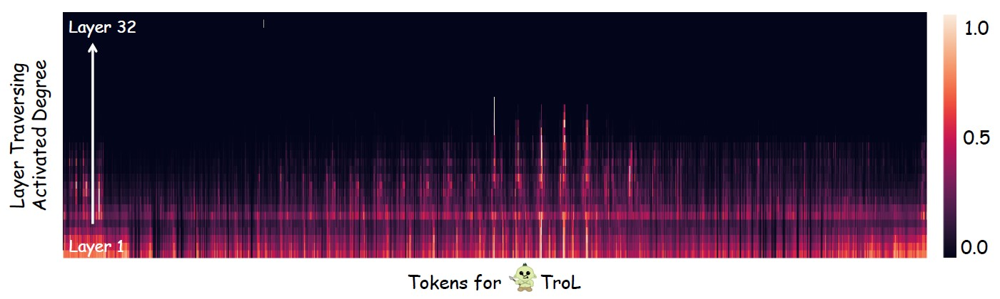

# TroL: Traversal of Layers for Large Language and Vision Models [[ArXiv]](https://arxiv.org/abs/2406.12246)


## 📰 News
Thanks to huggingface staff, we can use free ZeroGPU (NVIDIA A100) for each user but there are limited queries, so if the inferences are stuck, then please wait for few minutes. (Local demo speed is much more faster than this online GPU space.)
- TroL-1.8B is now available in 🤗[Huggingface Models](https://huggingface.co/BK-Lee/TroL-1.8B). (local demo readme included)
- TroL-3.8B is now available in 🤗[Huggingface Models](https://huggingface.co/BK-Lee/TroL-3.8B). (local demo readme included)
- TroL-7B is now available in 🤗[Huggingface Models](https://huggingface.co/BK-Lee/TroL-7B). (local demo readme included)
- Online TroL demo is now available in 🤗[Huggingface Spaces](https://huggingface.co/spaces/BK-Lee/TroL). (You can choose model size)

Official PyTorch implementation code for realizing the technical part of *Traversal of Layers (TroL)* to improve numerous vision language performances with efficient model size. This code is developed from scratch. so I have been trying to improve the readibility and simplicity of the code, compared with LLaVA which has relatively complexly structured code.

## 💡 Highlighted Images


Figure 1. TroL Layer. New Propagation.




Figure 2. Structure of TroL-Mixer.




Figure 3. Performances across numerous model sizes.




Figure 4. Comparison with Closed-source LLVMs.




Figure 5. Investigating where layer traversing (reusing layers) mostly happens.


## 📊 Results

Open-source LLVMs with Standard Model Size

| LLVMs         | SQA-IMG | POPE |  MME |  MMB | MathVista | SEED-IMG | MM-Vet | LLaVA-W |
|---------------|:-------:|:----:|:----:|:----:|:---------:|:--------:|:------:|:-------:|
| Yi-VL-6B      |   71.7  | 82.5 | 1915 | 64.2 |    29.7   |  67.5  |  32.1  |   51.9  |
| LLaVA-NeXT-7B |   70.1  | 86.5 | 1851 | 69.6 |    34.6   |  70.2  |  43.9  |   72.3  |
| MM1-7B        |   72.6  | 86.6 | 1858 | 72.3 |    35.9   |  70.9  |  42.1  |    -    |
| TroL-1.8B     |   87.5  | 88.6 | 2038 | 76.1 |    45.4   |  69.0  |  45.1  |   69.7  |
| TroL-3.8B     |   90.8  | 86.5 | 1980 | 79.2 |  **55.1** |  70.5  |  51.1  |   76.6  |
| TroL-7B       | **92.8**| **87.8** | **2308** |   51.8   |  **75.3** | **54.7** | **92.8** | **87.1** |

Open-source LLVMs with Large Model Sizes

| LLVMs             |   AI2D   |  ChartQA |    MME   |    MMB   | MathVista |  MM-Vet  |  LLaVA-W |
|-------------------|:--------:|:--------:|:--------:|:--------:|:---------:|:--------:|:--------:|
| InternVL1.5-40B   |   79.0   |   68.0   |   2175   |   82.2   |    47.7   |   48.9   |     -    |
| InternVL1.5-26B   | **80.7** | **83.8** |   2188   |   82.2   |    53.5   | **62.8** |     -    |
| MM1-30B           |     -    |     -    |   2069   |   75.1   |    39.4   |   48.7   |     -    |
| MiniGemini-34B    |     -    |     -    |   2105   |   79.6   |    38.9   |   53.0   |     -    |
| MiniGemini-HD-34B |     -    |     -    |   2141   |   80.6   |    43.3   |   59.3   |     -    |
| LLaVA-NeXT-34B    |   74.9   |   68.7   |   2030   |   79.3   |    46.0   |   57.4   |   88.8   |
| LLaVA-NeXT-8B     |   71.6   |   69.5   |   1972   |   72.1   |    37.5   |     -    |   80.1   |
| LLaVA-NeXT-72B    |   77.4   |   77.0   |   2159   |   80.5   |    46.6   |     -    |   89.2   |
| LLaVA-NeXT-110B   |   80.4   |   80.4   |   2201   |   80.5   |    49.0   |     -    |   90.4   |
| TroL-1.8B         |   68.9   |   64.0   |   2038   |   76.1   |    45.4   |   45.1   |   69.7   |
| TroL-3.8B         |   73.6   |   73.8   |   1980   |   79.2   |  **55.1** |   51.1   |   76.6   |
| TroL-7B           |   78.5   |   71.2   | **2308** | **83.5** |    51.8   |   54.7   | **92.8** |

Closed-source LLVMs

| LLVMs        |  SQA-IMG |   AI2D   |  ChartQA |    MME   |    MMB   | MathVista | SEED-IMG |  MMStar  |
|--------------|:--------:|:--------:|:--------:|:--------:|:--------:|:---------:|:--------:|:--------:|
| Qwen-VL-Plus |   71.6   |   75.9   | **78.1** |   2183   |   67.0   |    43.3   |   72.7   |   39.7   |
| Gemini-Pro   |   80.1   |   73.9   |   74.1   |   1933   |   73.6   |    45.2   |   70.7   |   41.6   |
| GPT-4V       |   84.6   |   78.2   |   78.5   |   1927   |   77.0   |    49.9   |   69.1   |   46.1   |
| TroL-1.8B    |   87.5   |   68.9   |   64.0   |   2038   |   76.1   |    45.4   |   69.0   |   45.5   |
| TroL-3.8B    |   90.8   |   73.6   |   73.8   |   1980   |   79.2   |  **55.1** |   70.5   |   46.5   |
| TroL-7B      | **92.8** | **78.5** |   71.2   | **2308** | **83.5** |    51.8   | **75.3** | **51.3** |


## 📋 Visual Instruction Tuning Dataset Description for TroL
Total: 2273830 (2.3M)
```shell
------------------------------
* Real-World Image: 755k
* Real-World Text: 143K
* Document & Chart & Diagram & Sign & Symbol: 627k
* Math: 747k
    - Math with Vision: 180k
    - Math with Text only: 566k
------------------------------

- ShareGPT4V-Caption [without SAM] (91021, 91k)
- ShareGPT4V-Instruction [Without few samples of OCR-VQA] (664703, 664k)
- ALLAVA4V-Text (143000, 143k)
- MiniGemini-Instruction [DocVQA, ChartQA, DVQA, AI2D] (27670, 27k)
- DocDownstream (574268, 574k)
- DocReason (25877, 25k)
- GLLaVA-Align (60252, 60k)
- GLLaVA-QA (117205, 117k)
- MathVision (3040, 3k)
- MathInstruct [TextOnlyDataset] (262040, 262k)
- MathPlus [TextOnlyDataset] (304754, 304k)
```

We collect the following nine datasets. For MiniGemini, we selectively use data samples only for DocVQA, ChartQA, DVQA, and AI2D. Therefore, it is no need for you to download all data samples for MiniGemini.

* ShareGPT4V [[link](https://github.com/InternLM/InternLM-XComposer/blob/main/projects/ShareGPT4V/docs/Data.md)]
* ALLAVA4V-Text [[link](https://huggingface.co/datasets/FreedomIntelligence/ALLaVA-4V/viewer/allava_text)]
* MiniGemini [[link](https://github.com/dvlab-research/MiniGemini)]
* DocDownstream [[link](https://huggingface.co/datasets/mPLUG/DocDownstream-1.0)]
* DocReason [[link](https://huggingface.co/datasets/mPLUG/DocReason25K)]
* GLLaVA [[link](https://huggingface.co/datasets/Luckyjhg/Geo170K)]
* MathVision [[link](https://huggingface.co/datasets/mathvision/mathvision)]
* MathInstruct [[link](https://huggingface.co/datasets/TIGER-Lab/MathInstruct)]
* MathPlus [[link](https://huggingface.co/datasets/TIGER-Lab/MATH-plus)]

Gathered Dataset Layout
```bash
TroL_Dataset_Path
├── llava                                                       # ShareGPT4V
│   └── llava_pretrain                  
│       └── images                  
├── coco                                                        # ShareGPT4V
│   └── train2017                   
├── sam                                                         # ShareGPT4V
│   └── images                  
├── gqa                                                         # ShareGPT4V
│   └── images                  
├── ocr_vqa                                                     # ShareGPT4V
│   └── images                  
├── textvqa                                                     # ShareGPT4V
│   └── train_images                    
├── vg                                                          # ShareGPT4V
│   ├── VG_100K                 
│   └── VG_100K_2                   
├── share_textvqa                                               # ShareGPT4V
│   └── images                  
├── web-celebrity                                               # ShareGPT4V
│   └── images                  
├── web-landmark                                                # ShareGPT4V
│   └── images                  
├── wikiart                                                     # ShareGPT4V
│   └── images                  
├── share_textvqa                                               # ShareGPT4V
│   └── images                  
├── docvqa                                                      # MiniGemini
│   └── images                  
├── chartqa                                                     # MiniGemini
│   └── train                   
│       └── images                  
├── dvqa                                                        # MiniGemini
│   └── images                  
├── ai2d                                                        # MiniGemini
│   └── images                  
├── imgs                                                        # DocDownstream & DocReason
│   └── ChartQA
│   └── DUE_Benchmark
│       └── DeepForm
│       └── DocVQA
│       └── InfographicsVQA
│       └── KleisterCharity
│       └── TabFact
│       └── WikiTableQuestions
│   └── TextCaps
│   └── TextVQA
│   └── VisualMRC
├── geo3k                                                       # GLLaVA
|   └── train
├── geoqa_plus                                                  # GLLaVA
├── images                                                      # MathVision
|
├── sharegpt4v_instruct_gpt4-vision_cap100k.json                # ShareGPT4V-Caption
├── sharegpt4v_mix665k_cap23k_coco-ap9k_lcs3k_sam9k_div2k.json  # ShareGPT4V-Instruction
├── Evol-Instruct-GPT4-Turbo-143K.json                          # ALLAVA4V-Text
├── train.jsonl                                                 # DocDownstream
├── detailed_explanation.jsonl                                  # DocReason
├── minigemini_instruction.json                                 # MiniGemini-Instruction
├── gllava_align.parquet                                        # GLLaVA-Align
├── gllava_qa.parquet                                           # GLLaVA-QA
├── mathvision.parquet                                          # MathVision
├── MathInstruct.json                                           # MathInstruct
└── mathplus.parquet                                            # MathPlus
```

## 📂 Evaluation Benchmarks

These are the list of evaluation datasets. If you completely download them, the dataset should be placed in the folder by the following below directory layout.

* Q-Bench [[link](https://github.com/Q-Future/Q-Bench)]
* SQA-IMG [[link](https://scienceqa.github.io/)]
* AI2D [[link](https://allenai.org/data/diagrams)]
* ChartQA [[link](https://huggingface.co/datasets/HuggingFaceM4/ChartQA)]
* SEED [[link](https://github.com/AILab-CVC/SEED-Bench)]
* POPE [[link](https://github.com/RUCAIBox/POPE)]
* HallusionBench [[link](https://github.com/tianyi-lab/HallusionBench)]
* MME [[link](https://github.com/BradyFU/Awesome-Multimodal-Large-Language-Models/tree/Evaluation)]
* MathVista [[link](https://github.com/lupantech/MathVista)]
* MMB [[link](https://github.com/open-compass/MMBench?tab=readme-ov-file)]
* MM-Vet [[link](https://github.com/yuweihao/MM-Vet)]
* LLaVA-W [[link](https://huggingface.co/datasets/liuhaotian/llava-bench-in-the-wild)]
* MMStar [[link](https://huggingface.co/datasets/Lin-Chen/MMStar)]
* MathVerse [[link](https://huggingface.co/datasets/AI4Math/MathVerse)]
* VisualWebBench [[link](https://huggingface.co/datasets/visualwebbench/VisualWebBench)]

Evaluation Dataset Directory Layout
```bash
Evaluation_Dataset_Path
├── LLVisionQA-QBench               # Q-Bench
├── ScienceQA                       # SQA-IMG
├── ai2d                            # AI2D
├── chartqa                         # ChartQA
├── SEED-Bench                      # SEED-IMG
├── POPE                            # POPE
├── HallusionBench                  # HallusionBench
├── MME_Benchmark_release_version   # MME
├── MathVista                       # MathVista
├── MMBench                         # MMB
├── mm-vet                          # MM-Vet
├── llava-bench-in-the-wild         # LLaVA Bench in the Wild
├── MMStar                          # MMStar
├── MathVerse                       # MathVerse
└── VisualWebBench                  # VisualWebBench
```
